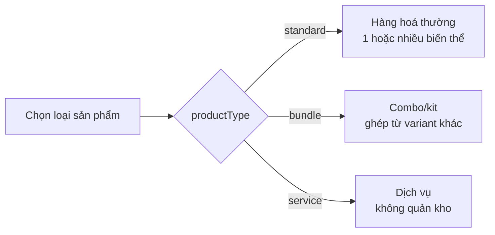
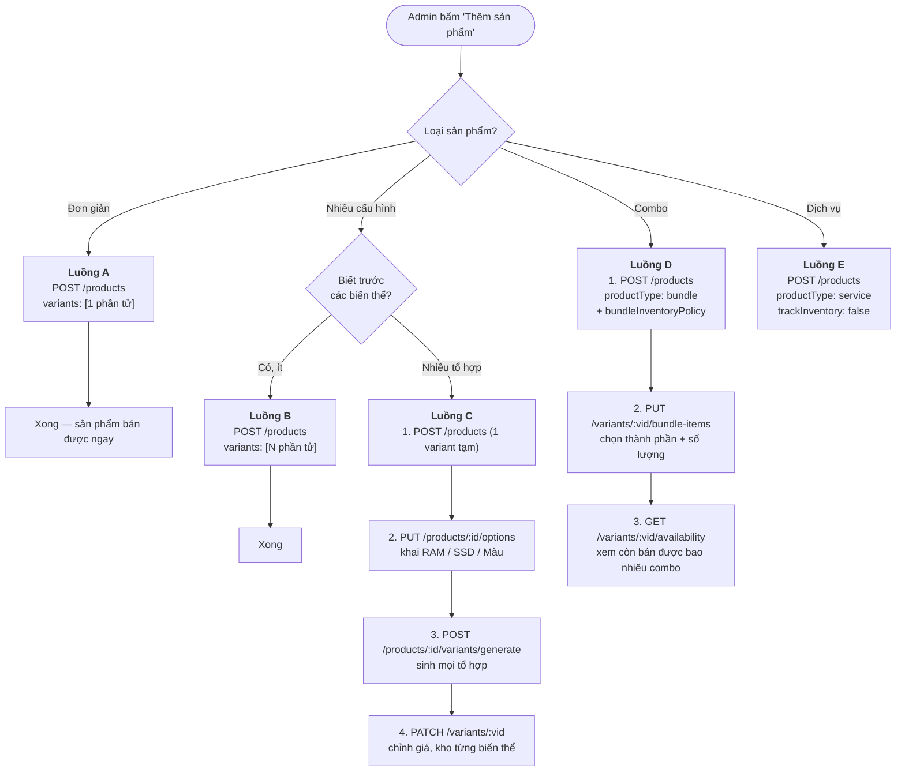
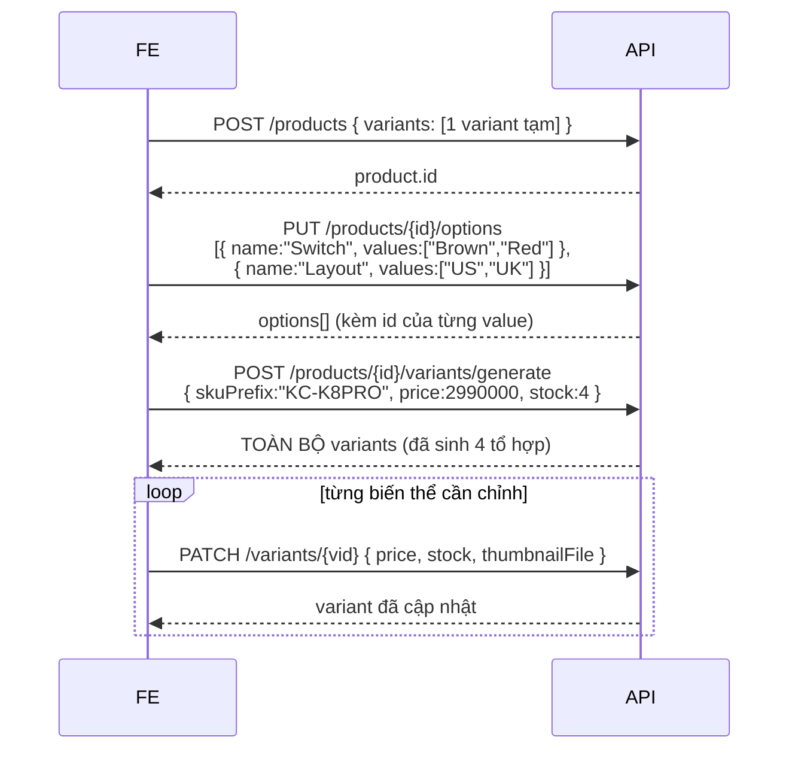
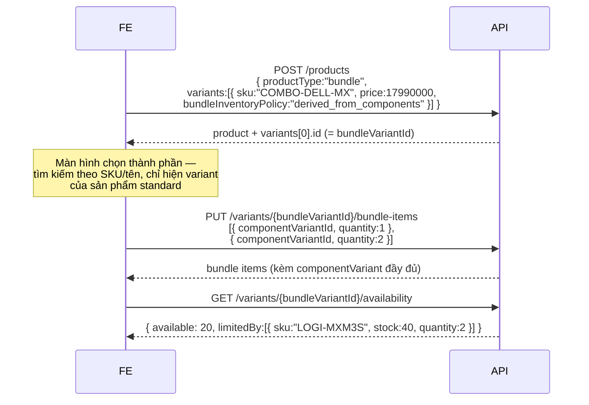
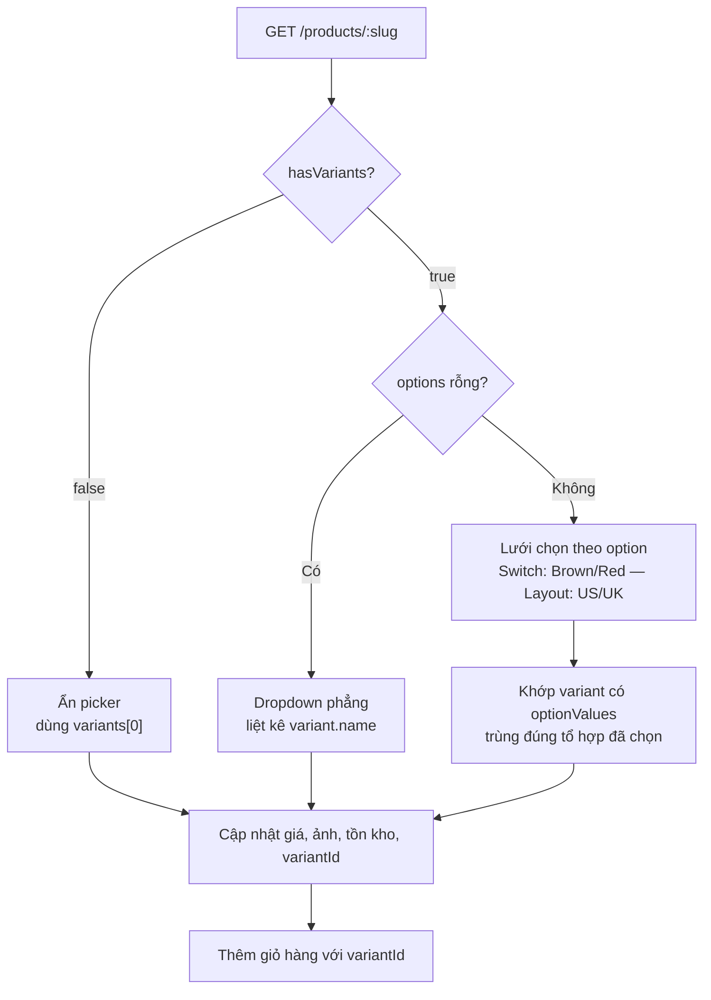

# Luồng tạo sản phẩm — hướng dẫn cho Frontend

Tài liệu mô tả cách dựng UI quản trị sản phẩm theo schema mới (master / variant /
bundle). Xem thêm [database-products.dbml](../database-products.dbml) cho sơ đồ dữ liệu.

## 0. Ba khái niệm bắt buộc phải nắm

| Khái niệm | Là gì | FE cần nhớ |
|---|---|---|
| **Product (master)** | Trang sản phẩm: tên, ảnh, mô tả, danh mục, thương hiệu | **Không bán được.** Không có giá, không có SKU, không có kho |
| **Variant** | Đơn vị bán được (SKU): giá, kho, mã vạch | **Mọi thứ liên quan tới mua bán đều dùng `variantId`** |
| **Option** | biến thể (RAM, Màu) và các giá trị hợp lệ | Nguồn sự thật để sinh tổ hợp biến thể |

> **Quy tắc số 1:** giỏ hàng và đơn hàng gửi `variantId`, **không bao giờ** gửi `productId`.
> Sản phẩm không có biến thể vẫn có đúng 1 variant mặc định — nó nằm sẵn ở `variants[0]`
> trong mọi response.

`productType` quyết định luồng nhập liệu:



---

## 1. Toàn cảnh các luồng tạo



---

## 2. Luồng A — Sản phẩm đơn giản

Trường hợp phổ biến nhất. UI: một form duy nhất, phần "Giá & kho" ghi thẳng vào
variant mặc định, admin không cần biết chữ "biến thể".

```http
POST /api/v1/products
Content-Type: application/json
```

```json
{
  "name": "Bàn phím cơ Keychron K8 Pro",
  "shortDescription": "Bàn phím cơ không dây",
  "status": "active",
  "categoryId": "…",
  "brandId": "…",
  "specifications": { "Layout": "TKL" },
  "variants": [
    { "sku": "KC-K8PRO", "price": 2990000, "stock": 15, "lowStockThreshold": 3 }
  ]
}
```

**Response** (rút gọn):

```json
{
  "id": "31d5a1c4-…",
  "hasVariants": false,
  "minPrice": 2990000,
  "maxPrice": 2990000,
  "totalStock": 15,
  "variants": [{ "id": "…", "sku": "KC-K8PRO", "name": "Bàn phím cơ Keychron K8 Pro", "isDefault": true }]
}
```

Ghi chú:

- `variants` **bắt buộc, tối thiểu 1 phần tử.** Không có API tạo sản phẩm rỗng —
  sản phẩm không có biến thể là hàng không bán được.
- Bỏ trống `variant.name` thì backend tự lấy tên sản phẩm.
- `hasVariants: false` → FE **không** hiện variant picker ở trang chi tiết.

### Upload ảnh cùng lúc

Đổi sang `multipart/form-data`, thêm `thumbnailFile` / `imagesFiles`.
Khi đó `variants` và `specifications` phải là **chuỗi JSON**:

```js
const fd = new FormData();
fd.append('name', 'Bàn phím cơ Keychron K8 Pro');
fd.append('status', 'active');
fd.append('variants', JSON.stringify([{ sku: 'KC-K8PRO', price: 2990000, stock: 15 }]));
fd.append('thumbnailFile', file);
imageFiles.forEach((f) => fd.append('imagesFiles', f));
```

---

## 3. Luồng B — Nhiều biến thể, khai tay

Dùng khi admin biết trước danh sách (2–5 cấu hình). UI: bảng biến thể có nút "Thêm dòng".

```json
{
  "name": "Laptop Lenovo ThinkBook 14 G6",
  "status": "active",
  "variants": [
    { "name": "16GB / 512GB", "sku": "LEN-TB14-16-512", "price": 18990000, "stock": 5 },
    { "name": "32GB / 1TB",  "sku": "LEN-TB14-32-1TB", "price": 24990000, "compareAtPrice": 26990000, "stock": 3, "isDefault": true }
  ]
}
```

- Không phần tử nào đặt `isDefault` → phần tử **đầu tiên** thành mặc định.
- Response: `hasVariants: true`, `minPrice: 18990000`, `maxPrice: 24990000` →
  trang danh sách hiển thị "18.990.000₫ – 24.990.000₫".

---

## 4. Luồng C — Sinh biến thể từ option

Dùng khi số tổ hợp lớn (2 RAM × 3 SSD × 4 màu = 24 biến thể).



Kết quả `generate` với ví dụ trên:

| SKU | name | optionValues |
|---|---|---|
| `KC-K8PRO-BROWN-US` | Brown / US | Switch=Brown, Layout=US |
| `KC-K8PRO-BROWN-UK` | Brown / UK | Switch=Brown, Layout=UK |
| `KC-K8PRO-RED-US` | Red / US | Switch=Red, Layout=US |
| `KC-K8PRO-RED-UK` | Red / UK | Switch=Red, Layout=UK |

Điểm quan trọng:

- **`generate` idempotent.** Tổ hợp đã có thì bỏ qua; thêm một giá trị option mới
  rồi generate lại chỉ sinh phần thiếu. Luôn trả về **toàn bộ** biến thể để FE
  vẽ lại bảng, không cần gọi thêm.
- **Khai option TRƯỚC khi tạo biến thể** nếu có thể. Biến thể tạo lúc chưa có
  option sẽ có `optionValues: []` — nó vẫn bán được nhưng không nằm trong lưới
  chọn cấu hình, FE nên cảnh báo admin xoá hoặc gán lại.
- `PUT /options` **thay thế toàn bộ**. Bị từ chối `400` nếu payload bỏ mất một
  giá trị đang được biến thể sử dụng:
  > `Không xoá được giá trị đang có biến thể sử dụng: switch::red, layout::uk. Xoá các biến thể đó trước.`
- Muốn đổi tổ hợp option của một biến thể đã tồn tại → **xoá rồi tạo lại**.
  `PATCH /variants/:id` không nhận `optionValueIds`.

### Thêm một biến thể lẻ vào sản phẩm đã có option

```http
POST /api/v1/products/{productId}/variants
```

```json
{ "sku": "KC-K8PRO-BLUE-US", "price": 3190000, "stock": 10,
  "optionValueIds": ["<id của Blue>", "<id của US>"] }
```

`optionValueIds` phải phủ **đúng 1 giá trị cho mỗi option** của sản phẩm, thiếu
hoặc thừa đều `400`.

---

## 5. Luồng D — Combo

### Chọn chính sách tồn kho

| `bundleInventoryPolicy` | Ý nghĩa | Kho | Khi bán |
|---|---|---|---|
| `derived_from_components` | Combo marketing, thành phần vẫn bán lẻ được | Suy ra từ thành phần, **admin không nhập tay** | Chỉ trừ kho thành phần |
| `own_stock` | Kit đóng gói sẵn tại kho | Nhập tay như hàng thường | Chỉ trừ kho combo |

Công thức tồn kho của `derived_from_components`:

```
available = MIN( floor(stock thành phần / số lượng cần) )
            trên các thành phần KHÔNG phải quà tặng (isOptional = false)
```

### Các bước



**Response `availability`** — dùng cho badge "Còn 20 combo" và cảnh báo kho:

```json
{
  "variantId": "…",
  "available": 20,
  "limitedBy": [{ "variantId": "…", "sku": "LOGI-MXM3S", "stock": 40, "quantity": 2 }]
}
```

`limitedBy` là thành phần đang chặn tồn kho — màn hình quản trị kho hiển thị
"Nhập thêm LOGI-MXM3S để tăng số combo bán được".
`available: null` = không giới hạn (mọi thành phần đều không quản kho).

### Ràng buộc FE nên chặn từ đầu

| Quy tắc | Lỗi backend trả về |
|---|---|
| Combo không chứa chính nó | `400 Combo không thể chứa chính nó` |
| Không cho combo lồng combo | `400 "<sku>" là một combo — không cho phép combo lồng combo` |
| Một thành phần chỉ 1 dòng, tăng `quantity` thay vì thêm dòng | `400 Một thành phần chỉ được khai một dòng…` |
| Không sửa kho combo `derived` | `400 Tồn kho combo derived_from_components suy ra từ thành phần…` |
| Không xoá variant đang là thành phần | `400 Biến thể đang là thành phần của một combo — gỡ khỏi combo trước khi xoá` |

### Đơn hàng chứa combo trông thế nào

Đặt **2 combo** (mỗi combo = 1 Dell + 2 chuột) sinh ra 3 dòng `order_items`:

| sku | variantName | unitPrice | quantity | total | parentItemId |
|---|---|---|---|---|---|
| `COMBO-DELL-MX` | Combo Dell + MX Master 3S | 17.990.000 | 2 | 35.980.000 | `null` |
| `DELL-V3520-I5` | Laptop Dell Vostro 3520 | 0 | 2 | 0 | ↑ dòng cha |
| `LOGI-MXM3S` | Logitech MX Master 3S | 0 | 4 | 0 | ↑ dòng cha |

> **FE hiển thị đơn hàng:** lọc `parentItemId === null` để lấy dòng tính tiền.
> Các dòng con là "gồm có…" hiển thị thụt vào dưới dòng cha, **không cộng vào tổng**
> (chúng luôn có `total = 0`).

---

## 6. Luồng E — Dịch vụ

```json
{
  "name": "Dịch vụ vệ sinh & tra keo tản nhiệt laptop",
  "productType": "service",
  "status": "active",
  "variants": [{ "sku": "SRV-CLEAN-LAPTOP", "price": 250000, "trackInventory": false }]
}
```

- `productType: "service"` → `trackInventory` mặc định `false`, FE ẩn toàn bộ ô kho.
- Bán được kể cả `stock = 0`; sản phẩm **không bao giờ** bị đánh dấu `out_of_stock`.
- Dùng chung cơ chế này cho hàng đặt trước (`productType: standard` + `trackInventory: false`).

---

## 7. Bảng API

### Product master

| Method | Endpoint | Quyền | Ghi chú |
|---|---|---|---|
| `GET` | `/products` | public | Danh sách, lọc, phân trang |
| `GET` | `/products/:id` | public | Chi tiết + toàn bộ `variants` + `options` |
| `GET` | `/products/slug/:slug` | public | Như trên, tự tăng `viewCount` |
| `POST` | `/products` | `product.manage` | **Bắt buộc kèm `variants`** |
| `PATCH` | `/products/:id` | `product.manage` | Chỉ master; không đụng biến thể |
| `DELETE` | `/products/:id` | `product.manage` | Xoá mềm, kéo theo biến thể |
| `GET` `PUT` | `/products/:id/description` | public / `product.manage` | HTML rich text |

### Biến thể & option

| Method | Endpoint | Quyền | Ghi chú |
|---|---|---|---|
| `GET` | `/products/:id/variants` | public | |
| `POST` | `/products/:id/variants` | `product.manage` | Thêm 1 biến thể |
| `POST` | `/products/:id/variants/generate` | `product.manage` | Sinh tổ hợp, idempotent |
| `GET` `PUT` | `/products/:id/options` | public / `product.manage` | `PUT` thay thế toàn bộ |
| `GET` | `/variants/:id` | public | |
| `PATCH` | `/variants/:id` | `product.manage` | Hỗ trợ multipart upload ảnh riêng |
| `PATCH` | `/variants/:id/stock` | `inventory.manage` | `{ delta, reason }`, `delta` âm để trừ |
| `DELETE` | `/variants/:id` | `product.manage` | |
| `GET` | `/variants/low-stock` | `inventory.manage` | Biến thể dưới ngưỡng |

### Combo

| Method | Endpoint | Quyền |
|---|---|---|
| `GET` `PUT` | `/variants/:id/bundle-items` | public / `product.manage` |
| `GET` | `/variants/:id/availability` | public |

---

## 8. Hiển thị ở phía khách hàng

### Trang danh sách — `GET /products`

Mỗi item có sẵn mọi thứ cần để render card, **không phải gọi thêm API**:

```json
{
  "name": "Laptop Lenovo ThinkBook 14 G6",
  "hasVariants": true,
  "minPrice": 18990000,
  "maxPrice": 24990000,
  "totalStock": 8,
  "variants": [{ "id": "…", "sku": "LEN-TB14-32-1TB", "price": 24990000, "isDefault": true }]
}
```

> ⚠️ Ở response **danh sách**, `variants` chỉ chứa **biến thể mặc định** (1 phần tử) —
> đủ để nút "Mua ngay" có `variantId`. Muốn đủ biến thể phải gọi `GET /products/:id`.

Quy tắc hiển thị giá:

```js
const price = product.hasVariants && product.minPrice !== product.maxPrice
  ? `${fmt(product.minPrice)} – ${fmt(product.maxPrice)}`
  : fmt(product.minPrice);
```

### Trang chi tiết — variant picker



Khớp variant từ tổ hợp option đang chọn:

```js
// selected: { [optionId]: optionValueId }
const selectedIds = new Set(Object.values(selected));
const match = product.variants.find(
  (v) =>
    v.optionValues.length === selectedIds.size &&
    v.optionValues.every((ov) => selectedIds.has(ov.id)),
);
```

Trạng thái hiển thị của một variant:

| Điều kiện | Hiển thị |
|---|---|
| `!variant.isActive` | Ẩn hoặc "Ngừng kinh doanh" |
| `variant.trackInventory === false` | Luôn cho mua |
| `variant.stock <= 0` | "Hết hàng", chặn thêm giỏ |
| `variant.compareAtPrice > variant.price` | Badge giảm giá |

Ảnh: `variant.thumbnail ?? product.thumbnail`, gallery `variant.images ?? product.images`.

### Đặt hàng — `POST /orders`

```json
{
  "items": [{ "variantId": "…", "quantity": 2 }],
  "shippingAddress": { "fullName": "…", "phone": "…", "street": "…", "province": "…" },
  "paymentMethod": "cod"
}
```

> **Breaking change:** `items[].productId` → `items[].variantId`.

---

## 9. Checklist migrate FE

- [ ] Giỏ hàng lưu `variantId` thay vì `productId` (xoá giỏ hàng cũ trong localStorage).
- [ ] `POST /orders` gửi `variantId`.
- [ ] Trang danh sách đọc `minPrice`/`maxPrice`/`totalStock` thay vì `price`/`stock`.
- [ ] Form tạo sản phẩm gửi kèm mảng `variants`.
- [ ] Màn hình điều chỉnh kho chuyển sang `PATCH /variants/:id/stock`.
- [ ] Trang cảnh báo kho đổi sang `GET /variants/low-stock` (trả biến thể, kèm `product`).
- [ ] Chi tiết đơn hàng lọc `parentItemId === null` cho dòng tính tiền.
- [ ] Trang chi tiết sản phẩm dựng variant picker từ `options` + `variants[].optionValues`.
